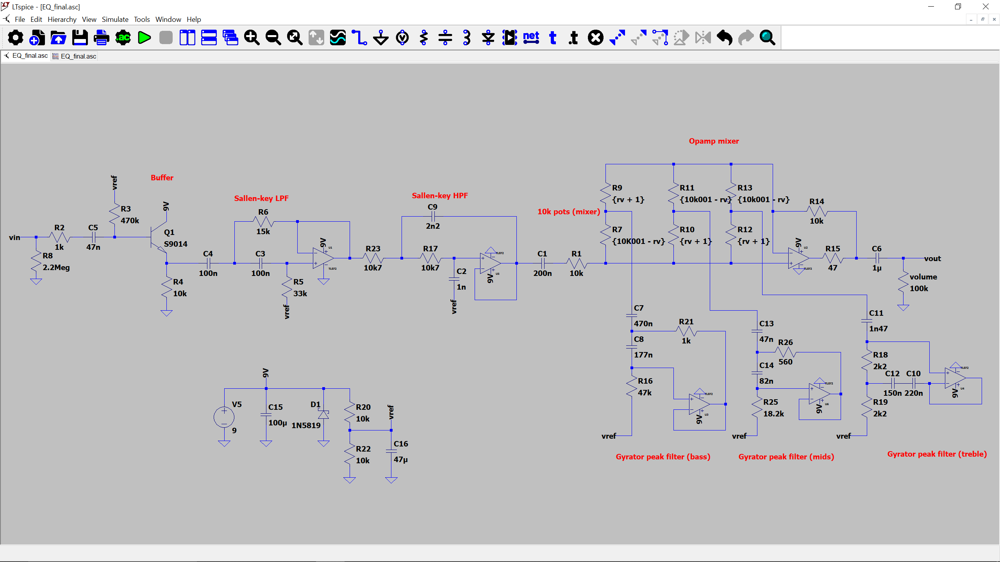
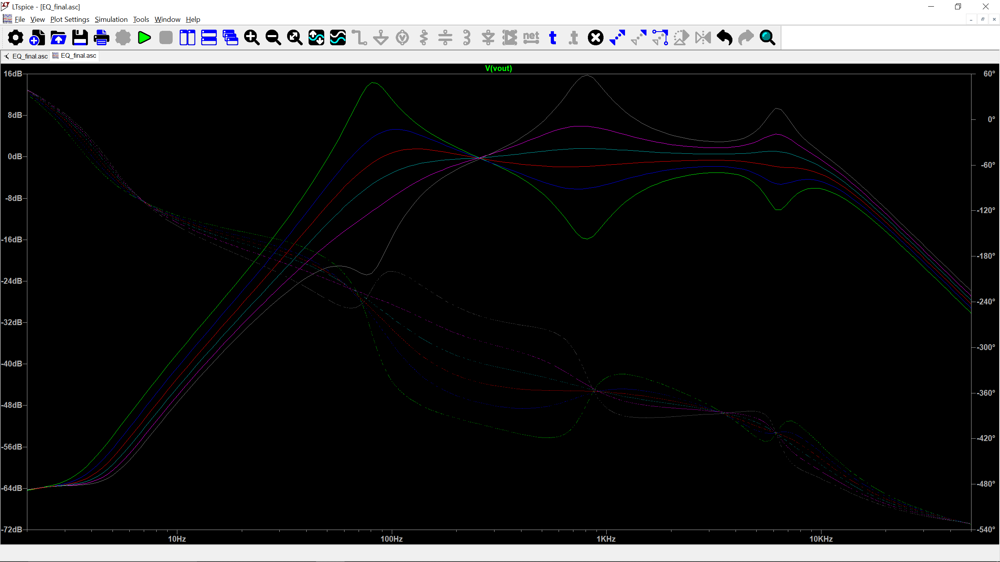
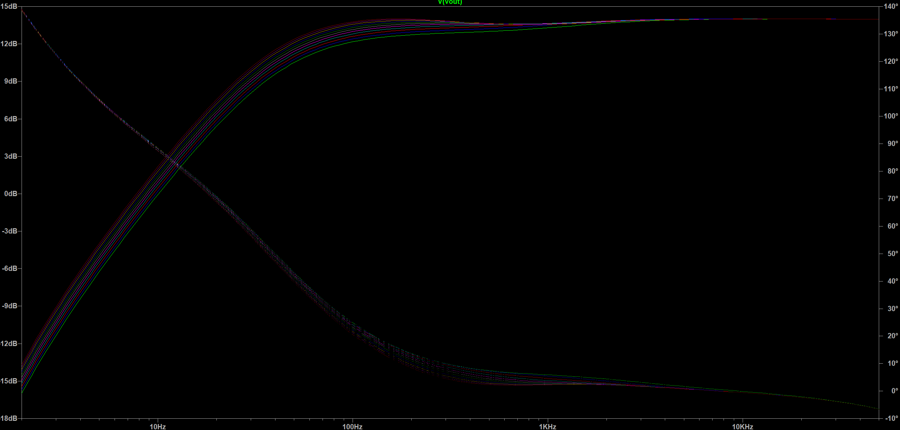
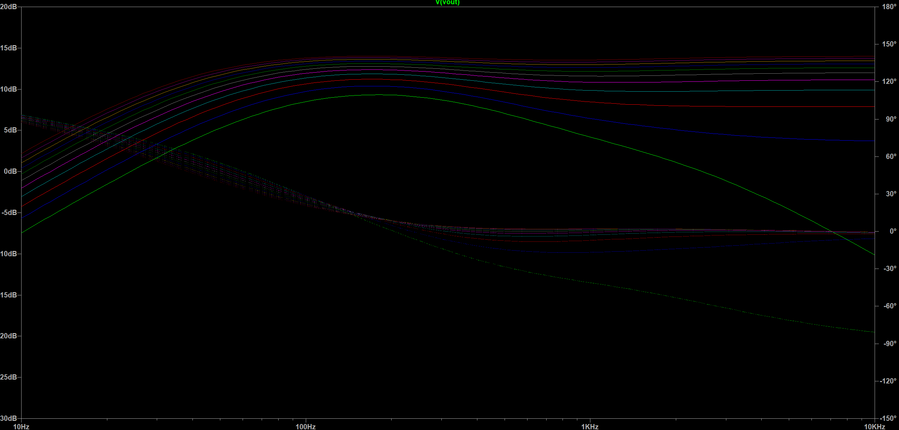
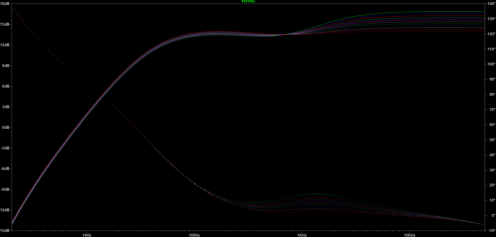

# 3 Channel Equalizer Pedal
The purpose of an equalizer (EQ) is to boost, cut, or shape specific audio frequencies in an audio signal. It lets the musician refine their tone, fix muddy sounds, and adjust their volume. 

- [Frequency Response](#frequency-response)
- [Iterations](#iterations)
- [Future Improvements](#future-improvements)

## Circuit & Example Audio Output

Audio input: 
Audio output after EQ: 

## Frequency Response
Using this  from neuraldsp.com, I set my channels to be centered at 80 Hz for bass, 800 Hz for mids, and ~6.3 kHz for the highs.

The frequency response graph sweeps across the 10kΩ mixer resistor of at intervals of 2kΩ, which is why there are multiple lines. Due to the nature of the guitar output frequencies being pretty close together (aside from some harmonics) and bandwidth limits, the channels are not fully independent.

## Iterations
I tried different types of filters when constructing this equalizer circuit. Shown below is my first iteration which was a passive resistor capacitor ladder which is similar to a Baxandall-style tone stack. It had a boosting stage at the end since the ladder only attenuates the signal.

While this tone stack has a smoother frequency response when changing each channel's potentiometer, that means that changes can bleed across channels. Furthermore, the treble knob is bridges the output of the tone stack and input of the boosting stage. As a result, turning the treble knob not only changes the treble level, but modifies the mixing of the bass and mids channel into the final signal, which could be an undesired side effect if the musician wants to make more targeted adjustments. Below are three images of the channels stepped through 100kΩ at intervals of 10kΩ. Image order: bass, mids, treble

After this, I tried using 

## Future Improvements
